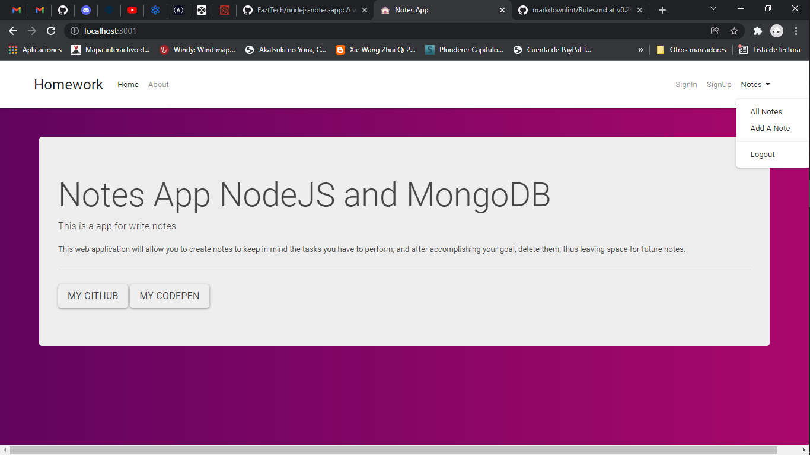

# Notes App NodeMongo

## This is a basic App to manage simple Notes on the web using Javascript Technologies like Nodejs, Mongodb, and other related technologies

## This app can do

## *CRUD Operations create/read/update/delete Notes

## *Allows a user to do login and save his personal notes

## Screenshot Home

## Screenshot Tasks

## Screenshot Login

### This application was developed for educational and practice purposes

### It is still under improvement
